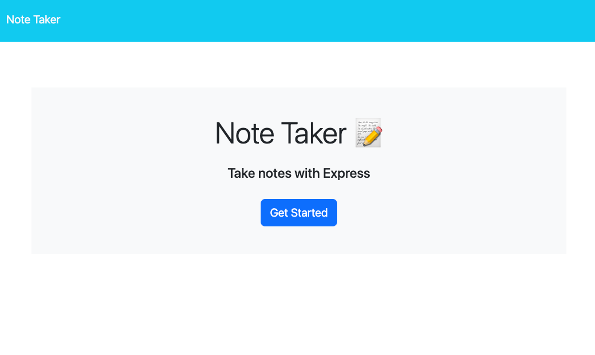
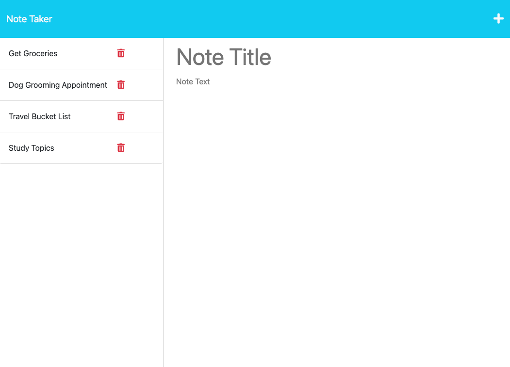
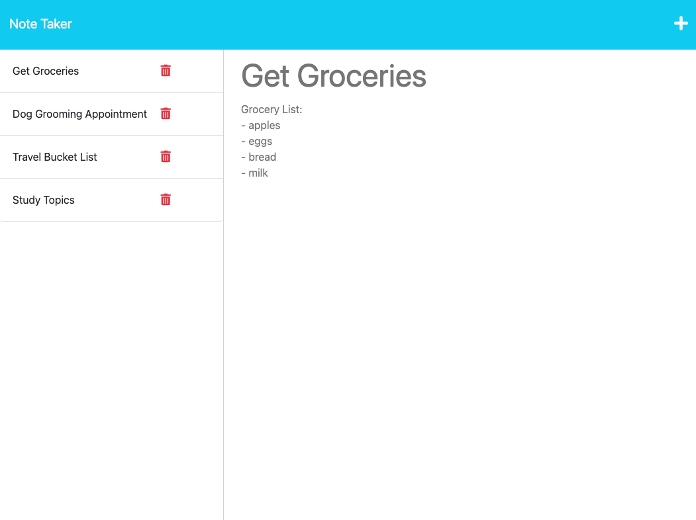

  
# NoteTaker

## Description

This Note Taker is built with Express.js that lets the user create a note with text. The user can create a new note, save notes, open previous notes and delete notes. As a University of Toronto Coding Bootcamp student, I want to be able to write, save and delete notes, so that I can organize my thoughts and keep track of tasks I need to complete. 

## Table of Contents 

- [Installation](#installation)
- [Usage](#usage)
- [How to Contribute](#contributions)
- [Tests](#tests)
- [Credits](#credits)
- [Questions](#questions)

## Installation 

N/A

## Usage 

Here is a video displaying how to application works: [NoteTaker Video](https://)

Once you have clicked on the link to the NoteTaker application, it will bring you to the NoteTaker homepage. Once you are here, click 'Get Started' to begin. 
## 
Once you have clicked 'Get Started' you will be brought to the main NoteTaker page where you will add, save, select and delete your notes! This page presents you with existing notes listed in the left-hand column, plus empty fields to enter a new note title and the note’s text in the right-hand column. When I enter a new note title and the note’s text, then a Save icon appears in the navigation at the top of the page. When I click on the Save icon, then the new note I have entered is saved and appears in the left-hand column with the other existing notes. When I click on an existing note in the list in the left-hand column, then that note appears in the right-hand column. When I click on the Write icon in the navigation at the top of the page, then I am presented with empty fields to enter a new note title and the note’s text in the right-hand column. To delete a note, there is a red trash button to the right of your saved note that will delete your note! 
## 
## 

## License Description

MIT License

Copyright (c) [2023]
    
Permission is hereby granted, free of charge, to any person obtaining a copy
of this software and associated documentation files (the "Software"), to deal
in the Software without restriction, including without limitation the rights
to use, copy, modify, merge, publish, distribute, sublicense, and/or sell
copies of the Software, and to permit persons to whom the Software is
furnished to do so, subject to the following conditions:
    
The above copyright notice and this permission notice shall be included in all
copies or substantial portions of the Software.
    
THE SOFTWARE IS PROVIDED "AS IS", WITHOUT WARRANTY OF ANY KIND, EXPRESS OR
IMPLIED, INCLUDING BUT NOT LIMITED TO THE WARRANTIES OF MERCHANTABILITY,
FITNESS FOR A PARTICULAR PURPOSE AND NONINFRINGEMENT. IN NO EVENT SHALL THE
AUTHORS OR COPYRIGHT HOLDERS BE LIABLE FOR ANY CLAIM, DAMAGES OR OTHER
LIABILITY, WHETHER IN AN ACTION OF CONTRACT, TORT OR OTHERWISE, ARISING FROM,
OUT OF OR IN CONNECTION WITH THE SOFTWARE OR THE USE OR OTHER DEALINGS IN THE
SOFTWARE.
[MIT License Link](https://choosealicense.com/licenses/mit)

## Contributions

Please contact me if you would like to contribute. You can find my information under the [Questions](#questions) section. 

## Tests 

N/A

## Credits 

Thank you to my tutor Andres Jiminez and my study partner [Rebecca Lawrence!](https://github.com/rkml14)

## Questions 

[GitHub Link](https://github.com/cassiewatsonn)

For any additional questions, please contact me by email at cassiewatsonn@gmail.com !